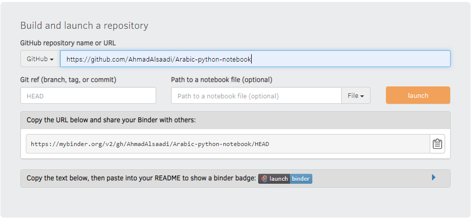
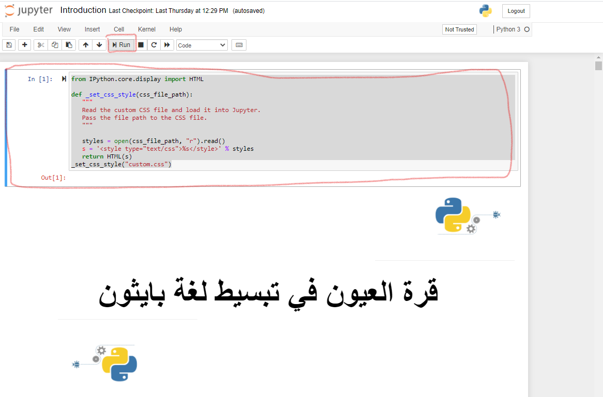

<!DOCTYPE html>
<html dir="rtl" lang="ar">
<head>
<meta charset="utf-8">
</head>
<body>

## اهداف الكتاب
يهدف هذا الكتاب الى توفير محتوى عربي سهل يمكن القارئ من تعلم لغة بايثون بحيث يمكن استخدامه كمادة علمية جامعية تدرس خلال ترم فصلي واحد  في احد التخصصات الهندسية. فالكتاب يحتوي على الكثير من التمارين التي تساعد الطلاب على تثبيت ما تعلموه من الكتاب من خلال امثلة تطبيقية تعزز لديهم فهم مبادئ البرمجة والتطبيقات التي يمكن استخدام هذه اللغة فيها.

### محتويات الكتاب
الفصل الاول: نبذة عن لغة بايثون  
الفصل الثاني: المبادئ الاساسية للغة بايثون  
الفصل الثالث: التعامل مع القوائم  
الفصل الرابع: حلقات التكرار  
الفصل الخامس: اتخاذ القرارات   
الفصل السادس: كتابة الدوال  
الفصل السابع: التعامل مع الملقات  
الفصل الثامن: التعامل مع المكتبات  
الفصل التاسع: البرمجة الشيئية في بايثون  
الفصل العاشر: برمجة واجهة المستخدم  
الفصل الحادي عشر: خصائص متقدمة للغة بايثون  
    

### كيف تقرأ الكتاب

    هناك طريقتين تمكنك من تصفح الكتاب والتفاعل معه وهي على النحو التالي:
    <ul>
        <li>فتح الكتاب عن طريق موقع binder</li>
        <li>فتح الكتاب عن طريق تنصيب اصدارة Anaconda على جهازك.</li>
    </ul>
    <ol>
        أولا: فتح الكتاب عن طريق موقع binder
         
        <li>قم بزيارة موقع <a href="mybinder.org">mybinder.org</a></li>
        <li>قم بنسخ رابط الكتاب من موقع github ولصقة في خانة العنوان ثم اضغط على زر launch  كما في الشكل التالي:
            </li>
        <li>اضغط بزر الفأرة نقرا مزدوجا على الملف introduction.ipynb لفتح الكتاب</li>
        <li>لاظهار ملف الكتاب بالشكل المطلوب قم بالضغط على اول خليه في الكتاب ومن ثم ضغط زر run من شريط الاوامر في jupyter. 
            
         </li>
    </ol>
    <ol>
        ثانيا: فتح الكتاب عن طريق تنصيب اصدارة Anaconda على جهازك.
        <li>تنصيب git: 
            <ol>
                <li>قم بتحميل ملف git من الرابط التالي:<a href="https://git-scm.com/downloads/">اضغط هنا</a> </li>
                <li>قم بتنصيب الملف الذي تم تحميله في الخطوة السابقة وقبول كافة الاعدادات الافتراضية بالضعظ على next في كل مرة.</li>
                <li>شاهد المقطع <a href="https://www.youtube.com/watch?v=2QP4QxzG-wY">التالي</a> على اليوتيوب وتنفيذ الخطوتين المطلوبة عند الدقيقة الرابعة لتعريف اسمك وايميلك لبرنامج git.</li>
            </ol>
        </li>
        <li>تنصيب anaconda: 
            <ol>
                <li>قم بتحميل اصدارة andconda من خلال الرابط : <a href="https://www.anaconda.com/products/individual" >التالي</a></li>
                <li>قم بتنصيب anaconda كما فعلت مع git في الخطوة السابقة.</li>
                <li>قم بمشاهدة مقطع اليوتيوب <a href="https://www.youtube.com/watch?v=gCjB3q9N9WI&list=PLKbdLIqXa5u23-nYbIG50TomKLCnGT6RH">التالي </a> للتعرف على anaconda و jupyter notebook.</li>
            </ol></li>
        <li>تحميل كتاب بايثون: 
            <ol>
                <li>لتحميل كتاب بايثون العربي نحتاج استخدام git من محث الاوامر في وندوز واسهل طريقة للقيام بذلك هي تكوين مجلد جديد نضع فيه الكتاب وليكون على سطح المكتب مثلا. لتكوين ملف جديد على سطح المكتب اضغط بالزر اليمن للفأرة على سطح المكتب واختر جديد ومن ثم اختر مجلد.</li>
                <li>قم بتسمية المجلد الجديد باي اسم تختاره وليكن python مثلا.</li>
                <li> قم بالدخول الى المجلد الجديد بالضغط المزدوج على هذا المجلد</li>
                <li>من خلال مستكشف الملفات في ويندوز قم بالضغط بزر الفأرة على مسار المجلد كما في الصورة التالية: 
                     
                </li>
                <li>قم بكتابة cmd واضغط على زر الادخال enter وسوف تفتح لك نافذه محث الاوامر السوداء كما في الصورة التالية: 
                </li>
                <li>قم بكتابة الامر التالي في محث الاوامر ومن ثم اضغط على زر الادخال: 
                git clone https://github.com/AhmadAlsaadi/Arabic-python-notebook.git
                 
                    سوف يقوم برنامج git بعمل نسخة من كتاب بايثون في المجلد الذي تم انشاؤه. 
                </li>
            </ol></li>
        <li>فتح كتاب بايثون: 
            <ol>
                <li>قم بالبحث في ويندوز عن برنامج jupyter notebook وقم بفتحه كما في الصورة التالية: 
                    
                </li>
                <li>سوف تفتح نافذه سوداء وهي خادم برنامج jupyter ونافذه اخرى في المتصفح هي برنامج jupyter.</li>
                <li>استخدم نافذه jupyter التي فتحت داخل المتصفح للذهاب الى مجلد الكتاب الذي تم نسخة الى المجلد الجديد الذي تم انشاؤه على سطح المكتب في خطوة سابقة.</li>
                <li>اضغط بزر الفأرة نقرا مزدوجا على الملف introduction.ipynb لفتح الكتاب</li>
                <li>لاظهار ملف الكتاب بالشكل المطلوب قم بالضغط على اول خليه في الكتاب ومن ثم ضغط زر run من شريط الاوامر في jupyter. 
                
                </li>
            </ol></li>
    </ol>
    

      
### طريقة المساهمة في كتابة هذا الكتاب:

</body>
</html>
